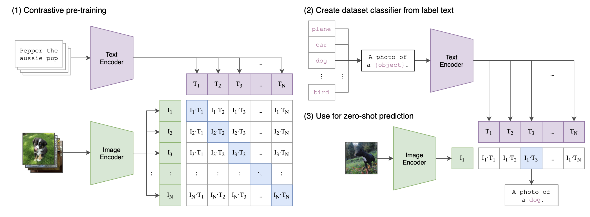
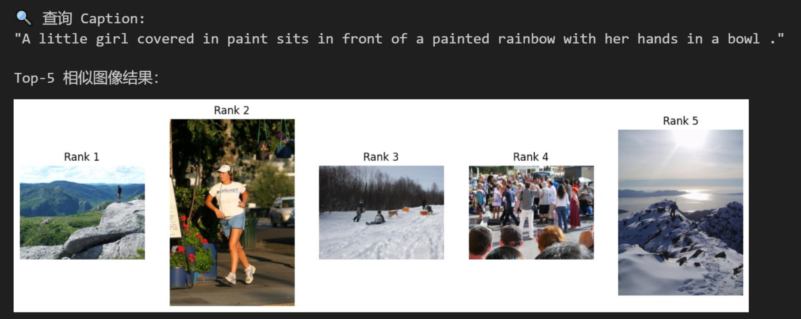

# 基于SigLIP的小规模图文检索系统

要求使用SigLIP模型，完成一个小规模图文检索系统的训练、验证和测试。

## 项目背景
多模态学习（Multimodal Learning）是当前人工智能领域的研究热点，其中视觉与语言的融合任务，如图文匹配、图文检索、图文生成等，具有广泛的应用前景。
CLIP（Contrastive Language–Image Pretraining）是 OpenAI 提出的多模态预训练方
法，利用图像-文本对比学习，使模型能自动将图像和文本嵌入到同一语义空间中，进而支持多种下游任务。然而该方案存在诸多问题，如强依赖大 batch size。
SigLIP（Sigmoid Loss for Language-Image Pretraining）是由 Google Research 提出的一种视觉-语言预训练方法，是对经典对比学习框架（如 CLIP）的重要改进。

## 任务目标

1. 理解 CLIP 与 SigLIP 在损失函数上的差异。
2. 使用Pytorch实现图像编码器、文本编码器和 SigLIP 损失函数。
3. 在 Flickr8k 数据集上训练模型，并报告 Text-to-Image 与 Image-to-Text 的 Recall@1/5/10。
4. 分析模型在多模态语义对齐方面的效果及可视化结果。
5. 基于 google/siglip-base-patch16-224 预训练模型，体验图文跨模态对比学习的核心结果——图文交叉相似度矩阵(代码在visualization/)。

## 技术路线与方法
1. 数据及选择：使用 Flickr8k 数据集，数据格式为图像 + 文字描述（1-5 条）。数据集下载可通过清华云盘链接：https://cloud.tsinghua.edu.cn/f/6e5dcf45eac345649665/
请将文件下载后放在\Flickr8k\images 目录下

2. 模型结构：
    + 图像编码器【Task1】
      + 使用 ResNet18 进行特征提取，输出特征向量。
      + 添加线性层映射到共享语义空间。
    + 文本编码器【Task2】
      + 使用 MLP 或 Transformer 提取文本表示。
      + 线性层将文本特征映射到相同维度的共享空间。
    + SigLIP损失函数【Task3】
      + SigLIP Loss（Sigmoid-based）
        设图像编码为 $z_i^{I}$，文本编码为 $z_j^{T}$，相似度仍采用余弦相似度：
        设一个 batch 中包含 $|\mathcal{B}|$ 个图文样本对，图像编码为 $x_i$，文本编码为 $y_j$，二者的相似度定义为：

        $$
        z_{ij} = \frac{x_i^\top y_j}{\|x_i\| \, \|y_j\|}
        $$

        其中，$t$ 为可学习的温度系数，$b$ 为可学习的偏置项。定义图文匹配标签为：

        $$
        s_{ij} =
        \begin{cases}
        +1, & i = j \\
        -1, & i \ne j
        \end{cases}
        $$

        则对于任意一对 $(i,j)$，SigLIP 的成对损失为：

        $$
        \mathcal{L}_{ij} = \log \left( 1 + \exp\left( s_{ij} \, (-t z_{ij} + b) \right) \right)
        $$

        因此，整个 batch 上的 SigLIP 损失为：

        $$
        \mathcal{L}_{\text{SigLIP}}
        =
        \frac{1}{|\mathcal{B}|}
        \sum_{i=1}^{|\mathcal{B}|}
        \sum_{j=1}^{|\mathcal{B}|}
        \mathcal{L}_{ij}
        $$
      
        即

        $$
        \mathcal{L}_{\text{SigLIP}}
        =
        \frac{1}{|\mathcal{B}|}
        \sum_{i=1}^{|\mathcal{B}|}
        \sum_{j=1}^{|\mathcal{B}|}
        \log \left( 1 + \exp\left( s_{ij} \, (-t z_{ij} + b) \right) \right)
        $$
    + 完成代码中 ResNet、 Transformer 模型的搭建以及SigLIP损失函数的编写，即可开始训练

3. 训练流程
    1. 图像 + 文本 输入模型 
    2. 提取图像特征 / 文本特征
    3. 归一化后计算余弦相似度矩阵
    4. 计算损失并反向传播
    5. 每轮评估 Top-K Accuracy / Recall@K 检索准确率，保存最优模型（此处需要在 train_siglip.py 中修改）

4. 结果分析与可视化
    1. 列出模型训练结束后的性能指标：Top-1 Accuracy / Recall@K
    2. 请编写文本 → 图像 Top-K 检索示例的可视化代码，例如：
    3. 结合模型训练结果和可视化分析的情况，尝试分析模型在文图检索任 务上的表现，比如对文本描述或者图像类型是否存在偏好，预测结果好/不好可能的原因是什么，哪些方向可以进行改进等等

## 文件说明

- `train_siglip.py`：完整训练、验证、测试入口。
- `loss.py`：SigLIP pairwise sigmoid loss。
- `data_loader.py`：Flickr8k 数据集读取与 dry-run 合成数据。
- `models/resnet_custom.py`：自定义 ResNet18 图像编码器。
- `models/transformer_encoder.py`：Transformer 文本编码器。
- `models/siglip_model.py`：组装图像编码器、文本编码器。
- `visualization`：基于google预训练模型的图文交叉相似度矩阵可视化演示。

代码中带有 `TODO(STUDENT)` 的位置，学生需要自行实现：

- `loss.py` 中 `SigLIPLoss.forward`。
- `models/resnet_custom.py` 中 `BasicBlock` 的卷积、BN、残差连接。
- `models/transformer_encoder.py` 中 forwad()函数。
- `train_siglip.py` 中 `evaluate_retrieval`, 评估 Top-K Accuracy / Recall@K (K=1/3/5 )检索准确率 。
- 需要按照 visualization 中 readme 的要求进行体验，结合可视化分析模型特性。

## 数据准备

目录结构建议如下：

```text
HW_SigLIP_2026_Student
  Flickr8k/
    images/
      *.jpg
    captions.txt
    train_captions.txt
    val_captions.txt
    test_captions.txt
```


## 快速运行

安装依赖：

```bash
pip install -r requirements.txt
```

无图片时先做 sanity check：

```bash
python train_siglip.py --dry-run --epochs 2 --batch-size 32 --num-workers 0
```

有 Flickr8k 图片时训练 `ResNet + Transformer`：

```bash
python train_siglip.py \
  --data-dir Flickr8k \
  --text-encoder transformer \
  --epochs 20 \
  --batch-size 64 \
  --output-dir outputs/resnet_transformer
```

对比一个轻量文本基线：

```bash
python train_siglip.py \
  --data-dir Flickr8k \
  --text-encoder mlp \
  --epochs 20 \
  --batch-size 64 \
  --output-dir outputs/resnet_mlp
```

训练时会保存 `outputs/.../best_siglip.pt` 和每轮覆盖更新的 `outputs/.../latest_siglip.pt`。从已有 checkpoint 继续训练时，`--epochs` 表示最终训练到第几轮；如果 checkpoint 保存于第 8 轮，下面命令会从第 9 轮继续训练到第 20 轮：

```bash
python train_siglip.py \
  --data-dir Flickr8k \
  --text-encoder transformer \
  --epochs 20 \
  --batch-size 64 \
  --output-dir outputs/resnet_transformer \
  --resume outputs/resnet_transformer/latest_siglip.pt
```

建议报告最终测试集的 `t2i_R@1/5/10` 和 `i2t_R@1/5/10`，并说明训练轮数、batch size、学习率、显卡型号。

